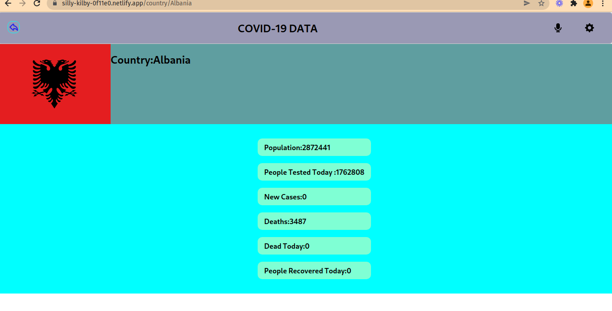

# COVID-19-Tracking-project

          

> COVID-19-Tracking-project is a project built using React and redux in this project information on the COVID-19 virus is being fetched from an API. This Application shows data on COVID-19 in European countries, the information is on COVID-19 cases, deaths, people tested etc.


Additional description about the project and its features.

# Built With

### Major languages
- HTML
- CSS
- JS
- JSX

### Frameworks/Libraries
- React

## Live Demo

[Click here](https://silly-kilby-0f11e0.netlify.app/) 

## Link to video
[click here](https://www.loom.com/share/91298e75f3c24f26846bcd510c905f80)

## Getting Started

To get a local copy up and running follow these simple example steps.
```
git clone https://github.com/zairdon20/Metrics-webapp.git

cd COVID-19-Tracking-project

npm i 

npm start 
```

### Prerequisites
```
node modules 
```
### Setup

In the project directory, you can run:

### `npm start`

Runs the app in the development mode.\
Open [http://localhost:3000](http://localhost:3000) to view it in the browser.

The page will reload if you make edits.\
You will also see any lint errors in the console.


### `npm run build`

Builds the app for production to the `build` folder.\
It correctly bundles React in production mode and optimizes the build for the best performance.

The build is minified and the filenames include the hashes.\
Your app is ready to be deployed!

See the section about [deployment](https://facebook.github.io/create-react-app/docs/deployment) for more information.

### Install

### Run tests
```
npm test
```

Launches the test runner in the interactive watch mode.\
See the section about [running tests](https://facebook.github.io/create-react-app/docs/running-tests) for more information.

### Deployment


## Author

- GitHub: [@zairdon20](https://github.com/zairdon20)
- Twitter: [@Josphat1](https://twitter.com/Josphat1)
- LinkedIn: [@Josphat Nkonde](https://www.linkedin.com/in/josphat-nkonde-092510183/)


## 🤝 Contributing

Contributions, issues, and feature requests are welcome!

Feel free to check the [issues page](../../issues/).

## Show your support

Give a ⭐️ if you like this project!

## Acknowledgments
Microverse

React and React Router documentation

Hats off to [Nelson Sakwa](https://www.behance.net/sakwadesignstudio) for the design inspiration.


### Data is provided by the following institutions:

- [Johns Hopkins University](https://systems.jhu.edu/research/public-health/ncov/)
- [Dipartimento della Protezione Civile of Italy](https://github.com/pcm-dpc/COVID-19)
- [Robert Koch Institute of Germany](https://www.rki.de/DE/Content/InfAZ/N/Neuartiges_Coronavirus/Situationsberichte/Gesamt.html)
- [Ministry of Health Spain](https://www.mscbs.gob.es/profesionales/saludPublica/ccayes/alertasActual/nCov/situacionActual.htm)
- [Santé publique France](https://www.santepubliquefrance.fr/dossiers/coronavirus-covid-19)

## 📝 License

This project is [MIT](./MIT.md) licensed.